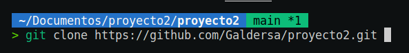

# Sitio Web Equipo Olímpico Orio Remo

## Tabla de contenido

1. Información general
2. Estado actual
3. Tecnologías utilizadas
4. Instalación y prueba
5. Marcos de competencia
6. Equipo
7. Agradecimientos

## Información general

Web estatica para equipo olímpico de remo de la localidad de Orio. Consta de:

* Home: información general
* Historia: historia del equipo, creación, fechas importantes.
* Noticias: noticias actuales y destacadas.
* Categorias Formativas: descripción de las diferentes categorias formativas: Alevines, infantiles, cadetes y juveniles.
* Categorias Liga: Presentación de categoria profesional femenina y masculina.
* Sobre nosotros: Mapa de ubicación, nota de contacto y dirigencia.
* Contacto: espacio dedicado para toma de contacto con la institución.

## Estado actual

Listo para el primer sprint review

## Tecnologías utilizadas

* HTML5
* CSS3
* JavaScript
* Figma
* Linux
* Git
* GitHub
* Visual Studio Code
* Trello

## Instalación y prueba

1. Copia la URL del proyecto
   
```
https://github.com/Galdersa/proyecto2.git
```

2. Abra una terminal, selecione la carpeta donde desea clonar el proyecto, después use el comando git clone y pegue la URL al final dejando un espacio.
3. Finalmente pulse enter. (Tenga en cuenta que debe tener instalado git)

 

```
$ git clone https://github.com/Galdersa/proyecto2.git
```
* Opcional: Puede copiar y pegar la linea anterior en su terminal en la carpeta elegida para clonar el proyecto.

4. Navegue hasta la carpeta clonada, abra el archivo index.html. Presione el botón derecho del ratón y elija la opción "Abrir en navegación predeterminado". Se abrira el navegador en la pagina 
   principal del proyecto y podrá navegar por el mismo.
   
## Marcos de competencia

* HTML5
* CSS3
* Flex Box
* CSS Grid
* Responsive Design
* JavaScript
* Figma
* Linux
* Git
* GitHub
* Visual Studio Code
* SCRUM
* Trello

## Equipo

* **Galder Suarez (SCRUM Master)**  
* **Anna Iashvili (Product Owner)**  
* **David Altamirano (Software Developer)**  
* **Elías Riquelme (Software Developer)**  

## Agradecimientos

* Agradecimiento especial al formador Andres Ocina por su paciencia y dedicación.
* A los miembros de los diferentes equipos que nos acompañan en este curso.


